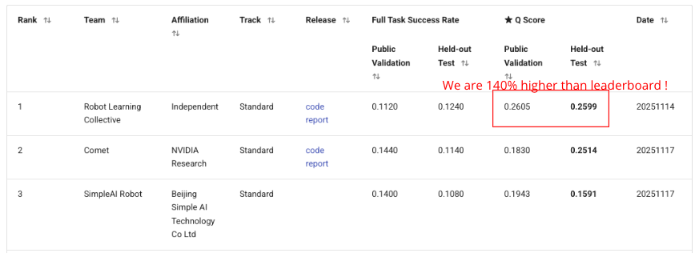
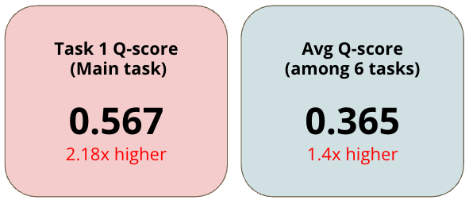
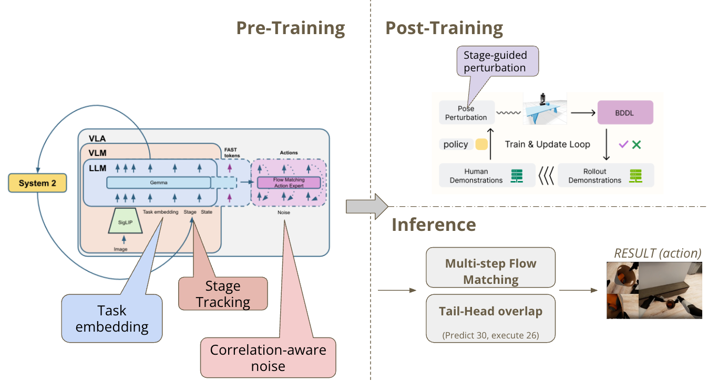

# BEHAVIOR-1K Challenge — Stage-Aware Pi0.5 VLA with Rejection-Sampling Fine-Tuning

> Our vision-language-action solution for the [2025 BEHAVIOR Challenge (NeurIPS 2025)](https://behavior.stanford.edu/challenge/): a **stage-aware Pi0.5 policy** adapted to long-horizon household tasks and hardened with **rejection-sampling fine-tuning** on stage-guided, pose-perturbed rollouts. Built on the open-source Pi0.5 backbone and the Comet RFT recipe — full credit in [Acknowledgments](#acknowledgments-and-references).

[](assets/Shao-Yang_Liu_BEHAVIOR-1K_VLA_Adaptation.pdf)
[](https://huggingface.co/datasets/MLfinal/behavior-1k-group29/tree/main/eval_results)
[](https://github.com/Sunliu36/Behavior1KChallenge_minor_Solution_by_SHAWN)
[](LICENSE)

> A reproducible recipe for long-horizon BEHAVIOR-1K household manipulation — Pi0.5 + rejection-sampling fine-tuning.





---

## Headline Results

Evaluated on the official challenge test instances of 6 representative tasks:

| Task ID | Task Name                  | Trials | Mean Q-score |
|--------:|----------------------------|------:|------------:|
| 1       | picking_up_trash           | 10    | **0.567** |
| 7       | picking_up_toys            | 10    | 0.200 |
| 18      | tidying_bedroom            | 10    | 0.467 |
| 21      | collecting_childrens_toys  | 8     | **0.604** |
| 27      | sorting_household_items    | 10    | 0.125 |
| 29      | clean_up_your_desk         | 2     | 0.227 |
| **Avg** | (50 trials, 6 tasks)       | 50    | **0.365** |

| Metric                    | Ours  | Leaderboard #1 | Improvement |
|--------------------------|------:|---------------:|------------:|
| Avg Q-score (6 tasks)    | 0.365 | 0.2599         | **+40 %**   |
| Task 1 Q-score (main)    | 0.567 | 0.260          | **+118 %**  |

---

## Resources & related repositories

* 📄 **Technical report:** [`assets/Shao-Yang_Liu_BEHAVIOR-1K_VLA_Adaptation.pdf`](assets/Shao-Yang_Liu_BEHAVIOR-1K_VLA_Adaptation.pdf) — *Shao-Yang Liu — Adapting Vision-Language-Action Models for BEHAVIOR-1K Household Tasks (2026)*. Contact: <shawnliu@gapp.nthu.edu.tw>
* 🎥 **Result videos & metric dumps:** [`MLfinal/behavior-1k-group29/eval_results`](https://huggingface.co/datasets/MLfinal/behavior-1k-group29/tree/main/eval_results) — per-task rollout mp4s + the original `metrics/*.json` files behind the headline table.

### Sibling method — point-cloud SFT branch (minor method)

Besides this main solution (Pi0.5 + RFT), we also explored a
**point-cloud-augmented supervised fine-tuning** branch built on Pi0.5 — the
second-checkpoint + point-cloud branch analysed in §6.1 of the technical report. Its
code, model, and eval videos live in a separate repository:

[](https://github.com/Sunliu36/Behavior1KChallenge_minor_Solution_by_SHAWN)
[](https://huggingface.co/Shawn3636/pi05-pcd-sft-step10k)
[](https://huggingface.co/datasets/codyweilee/behavior-1k-baseline/tree/main/eval_results)
[](LICENSE)

> A point-cloud-augmented supervised fine-tuning method built on Pi0.5 for the BEHAVIOR-1K 2025 Challenge.

---

## Why it works

**A strong backbone, made robust:**

* The **Pi0.5 backbone** gives a strong starting policy: a Pi0.5 VLA fine-tuned on the full challenge dataset with FAST tokenization, task embeddings (replacing the language model), correlation-aware flow-matching noise, and stage prediction. We start from its released checkpoints and use them as both the inference policy and the seed for further training.
* Our **RFT post-training** closes the sim-to-eval gap that hurts the base model on out-of-distribution initial conditions. The training loop perturbs the robot root pose, rolls out the current policy, scores trajectories with the simulator's reward signal, and continues training only on the successful rollouts (rejection sampling fine-tuning).

The result is a policy that retains the backbone's strong action distribution while becoming substantially more robust on each target task.



---

## Method Overview

### Pre-training (Pi0.5 VLA backbone)

Backbone: **Pi0.5 + task embeddings (no language model)**.

| Component                | Description |
|--------------------------|-------------|
| Vision encoder           | SigLIP, 224 × 224 RGB from `head`, `left_wrist`, `right_wrist` cameras |
| LLM block                | Gemma 2B used as cross-modal attention only (no text); replaced text prompts with **50 trainable task embeddings** |
| Action expert            | Flow Matching with **correlation-aware noise**: `noise ~ N(0, 0.5·I + 0.5·Σ)` where Σ is the empirical action correlation matrix |
| Auxiliary head           | **FAST tokens** for discrete action prediction (auxiliary loss 0.05) |
| Stage prediction         | "System 2" subtask classifier predicts 5–15 stages per task (auxiliary loss 0.1), fed back as input |
| Action space             | Δ-action (per-timestep normalized), 30-step horizon |
| Training scale           | All 50 tasks jointly, then split into 4 task-specific checkpoints |

Our adapted checkpoints (Pi0.5 backbone + RFT post-training) are released on HuggingFace: [`Shawn3636/pi05-rft-behavior1k`](https://huggingface.co/Shawn3636/pi05-rft-behavior1k).

| Checkpoint | # Tasks | Task IDs |
|-----------|--------:|----------|
| `checkpoint_1` | 20 | 2, 3, 5, 6, 10, 11, 13–15, 19, 23–25, 28, 29, 34, 42, 44, 47, 48 |
| `checkpoint_2` | 16 | **0, 1, 7, 8, 9, 12, 16, 17, 18, 20, 21, 22, 26, 30, 43, 45** |
| `checkpoint_3` | 13 | 4, 27, 31–33, 35–39, 41, 46, 49 |
| `checkpoint_4` | 1  | 40 |

### Post-training: RFT (Rejection-sampling Fine-Tuning) — from 2nd place (Comet)

We adopt Comet's *stage-guided pose perturbation* + RFT loop and apply it on top of each Pi0.5 backbone checkpoint.

1. **Rollout collection.** For each target task, sample `N` task instances from the **training** pool (200 per task). For each instance, perturb the robot root pose by a uniformly sampled `(Δx, Δy, Δθ)` with `Δx, Δy ∈ [−0.15 m, +0.15 m]` and `Δθ ∈ [−π/12, +π/12]`, then run the policy to completion.
2. **Filtering.** Keep rollouts with `q_score ≥ threshold` (typically `0.667`, i.e. the task was substantially completed). Failed trajectories are discarded.
3. **Conversion.** Convert each kept rollout into a LeRobot episode (`observation.state` proprio, `observation.cam_rel_poses`, `action`, plus per-camera mp4) and append to the task's training shard.
4. **Fine-tuning.** Resume training from the backbone checkpoint with the RFT episodes mixed in, for 1500–3000 additional steps, with frozen PaliGemma LLM backbone to keep training light.
5. **Re-evaluate** on the test instances and iterate if needed.

### Inference

* **Multi-step flow matching.** 15 action-expert predictions (different time + noise) per VLM forward pass to reduce variance.
* **Tail-Head overlap (rolling inpainting).** Predict 30 actions, execute 26, keep 4 as the conditioning prefix for the next chunk. The first 70 % of denoising steps inpaint these 4 actions softly, with the remaining 26 guided toward a linear-regression extrapolation.
* **General correction rule.** Open the gripper after a failed grasp attempt.
* **Multi-checkpoint switching.** A single server hosts all 4 checkpoints and selects one per request based on the `task_id` field in the observation.

---

## Repository Layout

```
B1K_1st_with_2nd/
├── README.md                        # ← you are here
├── PROJECT_STATUS.md                # detailed engineering log
├── assets/                          # README images
├── behavior-1k-solution/            # Pi0.5 backbone repo (fork w/ patches)
│   ├── scripts/
│   │   ├── serve_b1k.py             # policy WebSocket server
│   │   ├── train.py                 # bf16-patched training entry
│   │   ├── compute_norm_stats.py    # one-shot normalisation stats
│   │   └── train_fast_tokenizer.py
│   ├── src/b1k/
│   │   ├── training/config.py       # RFT + base training configs
│   │   ├── policies/b1k_policy.py   # state-extraction transforms
│   │   └── shared/eval_b1k_wrapper.py
│   ├── BEHAVIOR-1K/                 # upstream OmniGibson + bddl + joylo
│   │   └── OmniGibson/omnigibson/learning/
│   │       ├── eval.py              # vanilla evaluation entry
│   │       ├── eval_custom.py       # + perturb_pose + save_rollout (Comet)
│   │       ├── pose_perturbator.py  # ± 15 cm / ± 15° pose noise
│   │       └── wrappers/
│   └── task_checkpoint_mapping.json # task → checkpoint routing
├── patches/                         # diffs to reproduce our edits over upstream
├── src/
│   └── collect_rft_data.py          # rollout-to-LeRobot collector
└── script/                          # orchestration + evaluation shell scripts
    ├── auto_*.sh / launch_*.sh      # fine-tune orchestration
    ├── finetune_*.sh                # per-checkpoint fine-tune drivers
    └── run_*.sh                     # eval helpers
```

The four RFT helpers live under [`/media/Pluto/Shawn/NTHU_Course_1142/b1k/rft/`](file:///media/Pluto/Shawn/NTHU_Course_1142/b1k/rft):

```
rft/
├── launch_rollout.sh        # per-container rollout launcher
├── launch_robustness.sh     # perturb vs nominal comparison
├── build_rft_lerobot.py     # state_action.npz + mp4 → LeRobot dataset
├── filter_and_collect.py    # keep q ≥ threshold rollouts
├── convert_to_lerobot.py    # alternative converter
├── train_rft.sh             # FSDP training launcher
├── eval_rft_ckpt.sh         # eval an RFT checkpoint on test instances
└── run_rft_orchestrator.sh  # end-to-end pipeline driver
```

---

## Build Environment

### Hardware

| Item | Spec |
|---|---|
| GPUs | 3 × NVIDIA RTX 4090 (24 GB each) |
| CPU  | Intel i9-13900K (24 cores) |
| RAM  | 64 GB |
| OS   | Ubuntu 22.04, NVIDIA driver 580+ |

GPU 2 hosts the JAX policy server; GPUs 0–1 each run one OmniGibson container.

### Docker (recommended for evaluation)

OmniGibson and Isaac Sim 4.5.0 are run inside containers built from the official image, with persistent dependencies committed into `b1k_eval:installed`.

```bash
# Pull base image (once)
docker pull nvcr.io/nvidia/isaac-sim:4.5.0

# Long-running idle containers — one per evaluation GPU
docker run -d --name b1k_eval_g0 --gpus all --network host \
  -v /media/ML_2025:/media/ML_2025 \
  -v /media/Pluto:/media/Pluto \
  -v /media/public_dataset2:/media/public_dataset2 \
  -v /media/extra_home:/media/extra_home \
  --entrypoint bash b1k_eval:installed -c "sleep infinity"

# Same for b1k_eval_g1
```

Inside each container the following dependencies must be installed once (and then committed back into the image):

```bash
apt update && apt install -y git linux-libc-dev libudev-dev build-essential
/isaac-sim/python.sh -m pip install -e behavior-1k-solution/BEHAVIOR-1K/bddl
/isaac-sim/python.sh -m pip install -e "behavior-1k-solution/BEHAVIOR-1K/OmniGibson[eval]"
/isaac-sim/python.sh -m pip install -e behavior-1k-solution/BEHAVIOR-1K/joylo
```

### Host Python (for training and the policy server)

```bash
cd behavior-1k-solution
bash setup_remote.sh        # installs uv + all dependencies
uv run python -c "import openpi, jax; print(jax.devices())"
```

### Datasets and assets

| Asset | Source |
|---|---|
| OmniGibson scenes + challenge instances | [`behavior-1k/2025-challenge-demos`](https://huggingface.co/datasets/behavior-1k/2025-challenge-demos) |
| LeRobot training dataset (224 × 224)    | [`IliaLarchenko/behavior_224_rgb`](https://huggingface.co/datasets/IliaLarchenko/behavior_224_rgb) |
| Our checkpoints (Pi0.5 + RFT)           | [`Shawn3636/pi05-rft-behavior1k`](https://huggingface.co/Shawn3636/pi05-rft-behavior1k) |
| Normalisation stats (per checkpoint)    | shipped with each checkpoint |

Set this exact environment variable before any evaluation:

```bash
export OMNIGIBSON_DATA_PATH=/media/public_dataset2/behavior-1k/omnigibson_data
export OMNIGIBSON_APPDATA_PATH=/media/Pluto/Shawn/NTHU_Course_1142/b1k/outputs/og_appdata
```

---

## Gotcha: running on Blackwell GPUs (sm_120, e.g. RTX PRO 6000 / RTX 5090)

This stack was validated on **Ada (RTX 4090, `sm_89`)**. We first tried it on a
**Blackwell** card (**RTX PRO 6000**, compute capability **`sm_120`**) and hit a wall:
most pre-built CUDA wheels (PyTorch, JAX, flash-attn, etc.) predate `sm_120` and ship
**no matching GPU binary**, so they either JIT-recompile slowly or fail outright.

**Why a pre-built wheel may not run on `sm_120`.** A CUDA kernel reaches your GPU one of two ways:

* **Path A — compile from source on your machine.** `nvcc` is told your exact arch
  (`sm_XX`) and emits a binary tailored to it. Always works for your card; the cost is
  that every user needs a toolchain and a few minutes to build.
* **Path B — the developer pre-compiles once and ships a wheel.** `nvcc` produces a
  **fat binary** bundling kernels for several architectures at once, e.g.

  ```
  kernel.sm_70  (Volta)   kernel.sm_86  (RTX 3090)   kernel.sm_90  (H100)
  kernel.sm_80  (A100)    kernel.sm_89  (RTX 4090)   ...
  ```

  That wheel goes to PyPI; you `pip install` and run immediately — **but only if your
  arch is in the bundle**.

At runtime the framework looks up the kernel for your GPU. On `sm_120` it searches the
fat binary, finds **no `sm_120` slot** (the wheel was built before Blackwell existed),
and falls back:

1. **if the wheel also embeds PTX** (a forward-compatible virtual ISA), the driver
   **JIT-compiles PTX → `sm_120`** at load time and runs — correct, just slower on the
   first launch;
2. **if there is no PTX either**, it cannot run: you get `CUDA error: no kernel image is
   available for execution on the device`, a silent CPU fallback, or wrong results.

> **Analogy.** Pre-built wheels are off-the-rack clothes in S/M/L/XL/XXL. Your size is
> XXXL (`sm_120`) — not on the shelf. The only rescue is *stretchy fabric* (PTX) tailored
> on the spot; if the fit is off, you get silent problems.

**Practical fixes**

* Install a build that **explicitly targets `sm_120`** (CUDA **12.8+** / recent PyTorch &
  JAX nightlies) so a real `sm_120` binary — or at least `sm_90+PTX` — is present.
* For any source-built extension, export the arch before building so `nvcc` emits Blackwell
  code (with a PTX fallback):

  ```bash
  export TORCH_CUDA_ARCH_LIST="12.0+PTX"   # or "9.0+PTX" as a forward-compatible fallback
  ```
* Keep the **NVIDIA driver new enough for Blackwell** — the PTX-JIT path only works if the
  driver already knows `sm_120`.
* Verify at runtime:

  ```bash
  python -c "import torch; print(torch.cuda.get_device_capability())"   # expect (12, 0)
  python -c "import torch; torch.zeros(1, device='cuda')"               # must not raise 'no kernel image'
  ```

**The symptom that actually cost us Q-score: noisy camera renders.** OmniGibson /
Isaac Sim draws the robot's RGB cameras with **RTX ray tracing + a real-time denoiser**.
On `sm_120` the ray-tracing / denoising kernels had no matching binary and degraded to the
JIT / fallback path, so the rendered `head` and `wrist` images came out **heavily grained
and noisy** instead of clean. This is the worst kind of failure here: **the simulator does
not crash** — it runs, writes video, and reports numbers — but the VLA was trained on clean
224 × 224 renders, so noisy input is a silent distribution shift that the policy has never
seen. The model effectively looks at static, mis-grasps, and **Q-scores collapse for no
obvious reason**. If your rollouts look fine in logs but the camera frames are speckled,
suspect the renderer, not the policy. Moving evaluation back to **Ada (RTX 4090) / Hopper**
restored clean renders and normal scores; a Blackwell build only became usable once the
RTX/denoiser stack shipped real `sm_120` kernels.

---

## Training (RFT post-training)

> If you only want to evaluate the released checkpoints, **skip to the Inference section**.

The full loop is one shell command:

```bash
bash /media/Pluto/Shawn/NTHU_Course_1142/b1k/rft/run_rft_orchestrator.sh
```

It runs the four steps below sequentially. Each step can also be invoked on its own.

### 1. Collect rollouts with pose perturbation

```bash
bash /media/Pluto/.../rft/launch_rollout.sh b1k_eval_g0 0 13   # train indices 0–12
bash /media/Pluto/.../rft/launch_rollout.sh b1k_eval_g1 13 25  # train indices 13–24
```

Outputs:

```
rft/task1/
├── rollouts/<inst>_<epi>/state_action.npz      # proprio + action + cam_rel_poses + task_id
├── rollouts/<inst>_<epi>/{head,left_wrist,right_wrist}.mp4
└── metrics/picking_up_trash_<inst>_<epi>.json  # q_score, agent_distance, simulator_time
```

### 2. Filter and convert to LeRobot

```bash
python3 /media/Pluto/.../rft/build_rft_lerobot.py \
    --rft-dir /media/Pluto/.../rft/task1 \
    --task-name picking_up_trash --task-idx 1 \
    --threshold 0.667 \
    --expert-root /media/ML_2025/shawn/b1k/data/behavior_224_rgb \
    --out-root /media/Pluto/.../rft_data/task1_lerobot
```

This produces a standalone LeRobot dataset (`data/task-0001/episode_*.parquet`, `videos/...`, `meta/{info,episodes,episodes_stats,tasks}.jsonl`) that `train.py` can load directly.

### 3. Fine-tune from the backbone checkpoint

```bash
bash /media/Pluto/.../rft/train_rft.sh \
    /media/Pluto/.../rft_data/task1_lerobot \
    rft_task1_$(date +%H%M) \
    1500          # num_train_steps
```

Under the hood this calls:

```bash
CUDA_VISIBLE_DEVICES=0,1 uv run scripts/train.py rft_task1_picking_up_trash \
    --data.base_config.behavior_dataset_root=<rft_dataset> \
    --num_train_steps=1500 --batch_size=8 \
    --weight_loader.checkpoint_path=<ckpt2> \
    --exp_name=<exp_name> --overwrite
```

Configuration knobs live in [`behavior-1k-solution/src/b1k/training/config.py`](behavior-1k-solution/src/b1k/training/config.py), in particular `rft_task1_picking_up_trash` and the per-task `ft_ckpt*` entries. The PaliGemma LLM backbone is frozen (`freeze_filter=_LLM_FREEZE`) to keep optimiser state small.

### 4. Evaluate the RFT checkpoint

```bash
bash /media/Pluto/.../rft/eval_rft_ckpt.sh \
    /media/Pluto/.../outputs/checkpoints/rft_task1/<exp>/<latest>/ 5
```

This kills the current server, re-points `task_checkpoint_mapping.json` at the new checkpoint, restarts the server on GPU 2, and launches a 5-instance evaluation in `b1k_eval_g0`.

---

## Inference / Evaluation

Three steps: start the server, run the evaluator, summarise the metrics.

### 1. Start the policy server (GPU 2)

```bash
cd behavior-1k-solution
CUDA_VISIBLE_DEVICES=2 XLA_PYTHON_CLIENT_PREALLOCATE=false \
uv run scripts/serve_b1k.py \
    --task-checkpoint-mapping task_checkpoint_mapping.json \
    policy:checkpoint \
    --policy.config pi_behavior_b1k_fast \
    --policy.dir /media/ML_2025/shawn/b1k/checkpoints/checkpoint_2/checkpoint_2
```

Wait for the line `INFO:websockets.server:server listening on 0.0.0.0:8000` (cold start ~ 3 minutes). The server picks the right checkpoint per request using the `task_id` field of each observation.

### 2. Run evaluation inside a container

Stock single-server / no perturbation (matches the upstream evaluator):

```bash
docker exec -d b1k_eval_g0 bash -c '
  cd /media/extra_home/.../behavior-1k-solution/BEHAVIOR-1K/OmniGibson
  OMNIGIBSON_DATA_PATH=/media/public_dataset2/behavior-1k/omnigibson_data \
  OMNIGIBSON_APPDATA_PATH=/media/Pluto/.../outputs/og_appdata \
  OMNIGIBSON_GPU_ID=0 \
  /isaac-sim/python.sh -m omnigibson.learning.eval \
      policy=websocket task.name=picking_up_trash \
      eval_instance_ids="[0,1,2,3,4]" \
      model.host=localhost headless=true write_video=true \
      log_path=/media/Pluto/.../rft/task1_eval
'
```

Multi-rollout, with perturbation and `state_action.npz` recording (the path used by the RFT loop):

```bash
docker exec -d b1k_eval_g0 bash -c '
  cd /media/extra_home/.../behavior-1k-solution/BEHAVIOR-1K/OmniGibson
  OMNIGIBSON_DATA_PATH=/media/public_dataset2/behavior-1k/omnigibson_data \
  OMNIGIBSON_APPDATA_PATH=/media/Pluto/.../outputs/og_appdata \
  OMNIGIBSON_GPU_ID=0 \
  /isaac-sim/python.sh -m omnigibson.learning.eval_custom \
      policy=websocket task.name=picking_up_trash \
      eval_on_train_instances=true \
      eval_instance_ids="[0,1,2,3,4,5,6,7]" \
      perturb_pose=true save_rollout=true \
      write_video=true headless=true \
      log_path=/media/Pluto/.../rft/task1_rollouts
'
```

Each `eval` process drives its own OmniGibson scene; GPU 0 and GPU 1 can run an independent container in parallel, sharing the same policy server.

### 3. Summarise

```bash
python3 /media/Pluto/.../rft/summarize_q.py \
    /media/Pluto/.../rft/task1_eval \
    /media/Pluto/.../rft/task7_eval ...
```

Per-instance JSONs land in `<log_path>/metrics/<task>_<instance>_<episode>.json` with `q_score.final`, `agent_distance`, `simulator_steps`, and `normalized_*` ratios against the human demonstration.

---

## Reproducing the headline results

```bash
# 0. One-time setup
bash setup_remote.sh                          # host deps (uv venv)
docker pull nvcr.io/nvidia/isaac-sim:4.5.0    # eval container base

# 1. Download pre-trained checkpoints
huggingface-cli download Shawn3636/pi05-rft-behavior1k \
    --local-dir /media/ML_2025/shawn/b1k/checkpoints

# 2. Start the policy server (uses base ckpt2 by default)
bash script/run_baseline_eval.sh              # also starts server

# 3. Run the RFT pipeline for each target task
for task_id in 1 7 18 21 27 29; do
  bash rft/run_rft_orchestrator.sh $task_id
done

# 4. Final evaluation across all target tasks
bash script/run_all_evals.sh
```

The output `metrics/` JSONs aggregate into the headline table at the top of this README.

---

## Acknowledgments and References

This work is a **combination and extension** of two open-source releases. All credit for the model architecture, training, and the inference tricks goes to the original authors.

* **1st place — Robot Learning Collective** (IliaLarchenko · Zarin · Karnatak), *Task adaptation of Vision-Language-Action model*, [arXiv:2512.06951](https://arxiv.org/abs/2512.06951), code: <https://github.com/IliaLarchenko/behavior-1k-solution>, checkpoints: <https://huggingface.co/IliaLarchenko/behavior_submission>.
* **2nd place — Comet / NVIDIA Research** (M. Li et al.), code: <https://github.com/mli0603/openpi-comet>.
* **BEHAVIOR-1K Benchmark** — Li et al., *BEHAVIOR-1K: A Human-Centered, Embodied AI Benchmark*, [arXiv:2403.09227](https://arxiv.org/abs/2403.09227), <https://github.com/StanfordVL/BEHAVIOR-1K>.
* **Pi0.5** — Physical Intelligence, [blog](https://www.physicalintelligence.company/blog/pi05), [paper](https://www.physicalintelligence.company/download/pi05.pdf), `openpi` code: <https://github.com/Physical-Intelligence/openpi>.

Engineering log of this project: [`PROJECT_STATUS.md`](PROJECT_STATUS.md).

## Citation

If you find this project useful, please cite:

```bibtex
@techreport{liu2026behavior1k_rft,
  author      = {Shao-Yang Liu},
  title       = {Adapting Vision-Language-Action Models for BEHAVIOR-1K Household Tasks},
  institution = {National Tsing Hua University},
  year        = {2026},
  email       = {shawnliu@gapp.nthu.edu.tw},
  note        = {Technical report. PDF: assets/Shao-Yang_Liu_BEHAVIOR-1K_VLA_Adaptation.pdf}
}
```

For questions about this project, please contact <shawnliu@gapp.nthu.edu.tw>.
